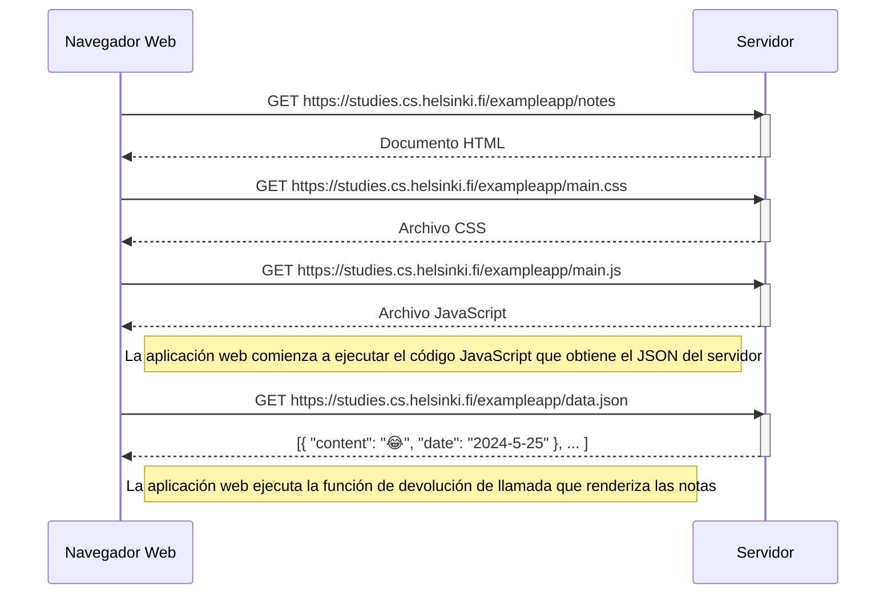
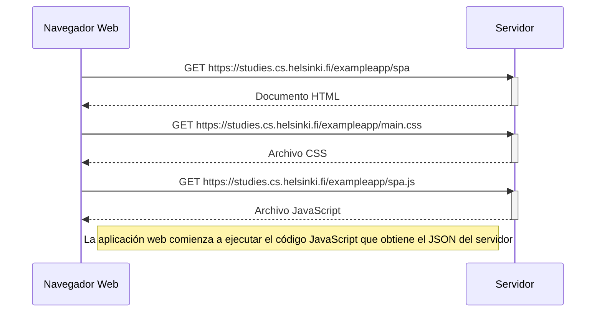
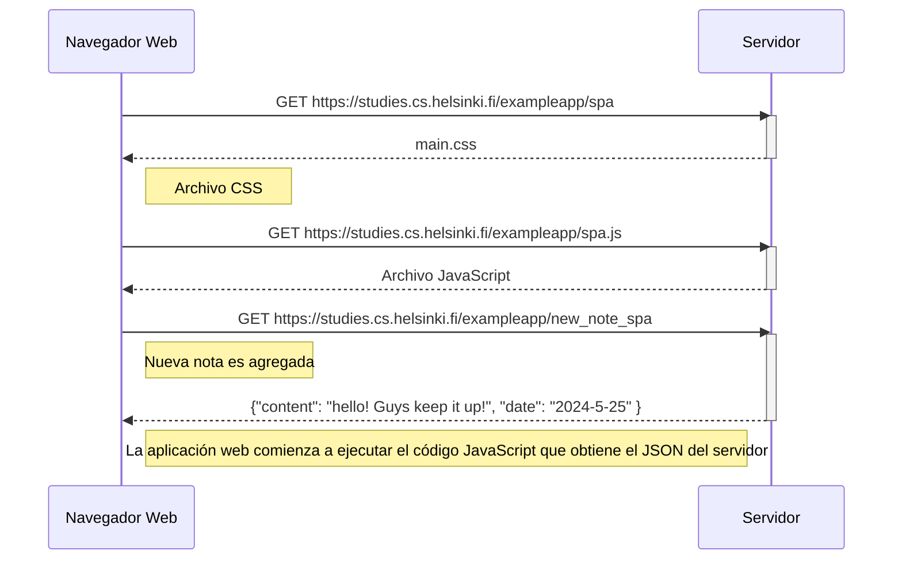

# Part 0.4 Diagram

```mermaid
sequenceDiagram
participant Navegador Web
    participant Servidor

    Navegador Web->>Servidor: GET https://studies.cs.helsinki.fi/exampleapp/notes
    activate Servidor
    Servidor-->>Navegador Web: Documento HTML
    deactivate Servidor

    Navegador Web->>Servidor: GET https://studies.cs.helsinki.fi/exampleapp/main.css
    activate Servidor
    Servidor-->>Navegador Web: Archivo CSS
    deactivate Servidor

    Navegador Web->>Servidor: GET https://studies.cs.helsinki.fi/exampleapp/main.js
    activate Servidor 
    Servidor-->>Navegador Web: Archivo JavaScript
    deactivate Servidor

    Note right of Navegador Web: La aplicación web comienza a ejecutar el código JavaScript que obtiene el JSON del servidor

    Navegador Web->>Servidor: GET https://studies.cs.helsinki.fi/exampleapp/data.json
    activate Servidor
    Servidor-->>Navegador Web: [{ "content": "😂", "date": "2024-5-25" }, ... ]
    deactivate Servidor

    Note right of Navegador Web: La aplicación web ejecuta la función de devolución de llamada que renderiza las notas
```
# Part 0.5 Diagram

```mermaid

sequenceDiagram
    participant Navegador Web
    participant Servidor

    Navegador Web->>Servidor: GET https://studies.cs.helsinki.fi/exampleapp/spa
    activate Servidor
    Servidor-->>Navegador Web: Documento HTML
    deactivate Servidor

   Navegador Web->>Servidor: GET https://studies.cs.helsinki.fi/exampleapp/main.css
    activate Servidor
    Servidor-->>Navegador Web: Archivo CSS
    deactivate Servidor

    Navegador Web->>Servidor: GET https://studies.cs.helsinki.fi/exampleapp/spa.js
    activate Servidor 
    Servidor-->>Navegador Web: Archivo JavaScript
    deactivate Servidor

    Note right of Navegador Web: La aplicación web comienza a ejecutar el código JavaScript que obtiene el JSON del servidor

```
# Part 0.6 Diagram

```mermaid

sequenceDiagram
    participant Navegador Web
    participant Servidor

    Navegador Web->>Servidor: GET https://studies.cs.helsinki.fi/exampleapp/spa
    activate Servidor

    Servidor-->> Navegador Web: main.css
    deactivate Servidor

    Note right of Navegador Web: Archivo CSS

    Navegador Web->> Servidor: GET https://studies.cs.helsinki.fi/exampleapp/spa.js
    activate Servidor

    Servidor-->> Navegador Web:  Archivo JavaScript
    deactivate Servidor

    Navegador Web->> Servidor: GET https://studies.cs.helsinki.fi/exampleapp/new_note_spa
    activate Servidor

    Note right of Navegador Web: Nueva nota es agregada 

    Servidor-->> Navegador Web: {"content": "hello! Guys keep it up!", "date": "2024-5-25" }
    deactivate Servidor
    Note right of Navegador Web: La aplicación web comienza a ejecutar el código JavaScript que obtiene el JSON del servidor
```
